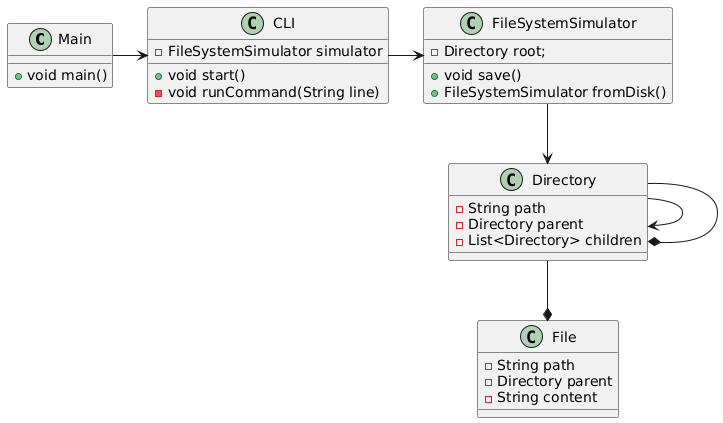

# File System Simulator

Aplicação para simular um sistema de arquivos.

## Metodologia

O simulador será desenvolvido em linguagem de programação Java. Ele receberá as chamadas de métodos com os devido parâmetros. Em seguida, serão implementados os métodos correspondentes aos comandos de um SO.

O programa executará cada funcionalidade e exibirá o resultado na tela quando necessário.

## Introdução ao Sistema de Arquivos com Journaling

Um sistema de arquivos é a estrutura lógica utilizada por sistemas operacionais para organizar, armazenar e recuperar dados em dispositivos de armazenamento (exemplos: discos rígidos, SSDs ou pendrives).
Ele define como armazenar os dados e suas estrituras facilitando o acesso simples e eficiente as informações.

O journaling é uma técnica usada para aumentar a confiabilidade e reduzir riscos de corrupção de dados. Ele funciona como um diário de transações antes de realizar uma operação definitiva no disco, o sistema registra no journal (log) o que será feito. Caso ocorra uma falha (queda de energia, travamento, desligamento inesperado), o sistema pode consultar o journal e recuperar ou reverter operações incompletas, evitando inconsistências.


Tipos de Journaling:
- Write-Ahead Logging (WAL):
  - As alterações são registradas no journal antes de serem aplicadas ao sistema de arquivos.
  - Garante que nenhuma operação seja perdida, pois o log serve como referência para recuperação.
- Log-Structured File Systems:
  - Todo o sistema de arquivos é tratado como um grande log.
  - Novos dados e metadados são sempre adicionados sequencialmente ao final do log, otimizando gravações em dispositivos como SSDs.
- Journaling parcial vs. completo:
  - Parcial (metadados): apenas informações sobre a estrutura do sistema de arquivos são registradas.
  - Completo (dados + metadados): tanto os dados quanto os metadados são protegidos, oferecendo maior segurança, mas com custo de desempenho.

## Arquitetura do Simulador



No projeto a interatividade é lidada pela classe `CLI`, enquanto as
operações de manipulação do sistema de arquivos e salvar os dados é
feito pelo `FileSystemSimulator` em que ele tem um atributo que
representa a raíz do sistema de arquivos a classe `Directory` representa
um diretório que contem filhos que podem ser outros diretórios ou
arquivos. O `FileSystemSimulator` tem uma propriedade da classe `Journal` que
é responsavel por fazer os logs de operações do sistema em um arquivo binário `file-system.journal`
caso o arquivo de dados do sistema de arquivos corrompa os dados são restaurados a partir dos dados
do `Journal`.

A classe `Journal` por sua vez representa cada log como um `JournalItem` que tem o tipo
da operação, seus dados e data da operação.

## Instalação e funcionamento 

Pelo terminal estando na raiz do projeto (FileSystemSimulator), compile os arquivos com o comando:

```shell
javac -d out src/*.java src/exceptions/*.java
```

Execute o programa com 

```shell
java -cp out Main
```

Ao entrar no projeto ele simulara uma cli do sistema de arquivos
apenas com o diretorio raíz `/`, vocë pode digitar o comando `help`
para obter ajuda.

Estão disponiveis os seguintes comandos:

**Navegação:**
- ls [diretório]          - Listar arquivos do diretório atual ou especificado
- cd <diretório>          - Mudar para o diretório especificado
- pwd                     - Exibir o caminho do diretório atual

**Manipulação de Arquivos:**
- touch <arquivo>         - Criar um novo arquivo
- cp <origem> <destino>   - Copiar arquivo
- rm <arquivo>            - Remover arquivo
- mv <antigo> <novo>      - Renomear arquivo

**Manipulação de Diretórios:**
- mkdir <diretório>       - Criar um novo diretório
- rmdir <diretório>       - Remover diretório
- mvdir <antigo> <novo>   - Renomear diretório

**Sistema:**
- help                    - Exibir esta mensagem de ajuda
- journal                 - Exibir journal
- clear                   - Limpar a tela
- exit                    - Sair do simulador

